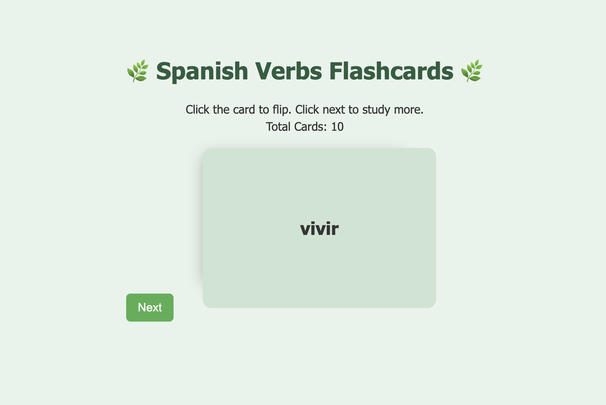
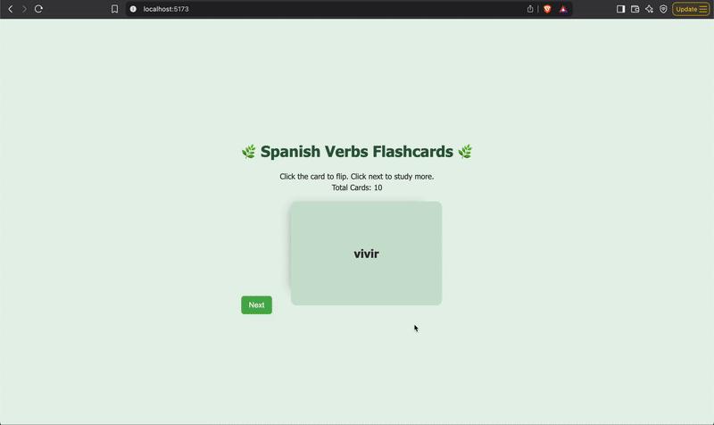

# Spanish Verbs Flashcards 🌿

This React app helps users study Spanish verbs through interactive flashcards.

## Features Implemented

- ✅ The app displays the **title** of the card set.
- ✅ A **short description** is displayed below the title.
- ✅ The **total number of cards** is shown.
- ✅ The card set is a list of pairs (an array of dictionaries with `verb`, `meaning`, and `example`).
- ✅ Only **one card is shown at a time**.
- ✅ Each card displays only one side (front or back).
- ✅ Clicking the card **flips** it to show the back (and flips again to return to the front).
- ✅ Clicking the **Next** button shows a **new random card**.

## Screenshot

## Demo GIF

